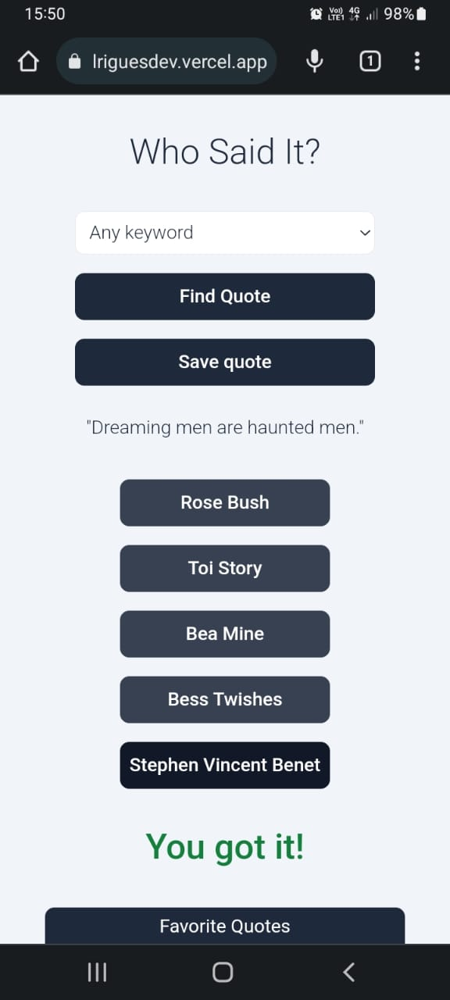
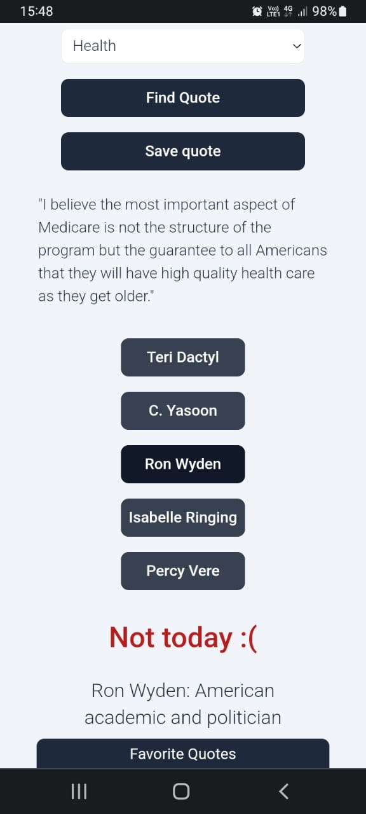
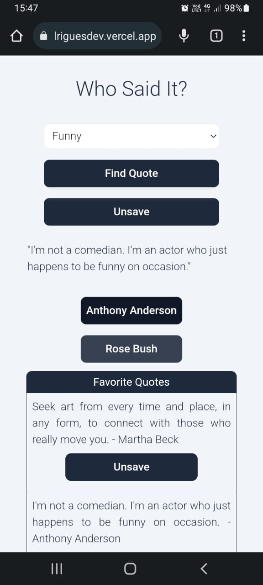

# [Who Said it?](https://who-said-it-talesrodriguesdev.vercel.app/)

It's a React app all about quotes! You can choose a keyword and get a random quote about it. You'll also be able to guess "Who said it?" and save your favorite quotes.

This is the second version of this app. It was built with TypeScript, has a cleaner design, uses the APIs more efficiently, handle its errors and doesn't need React Router, among other improvements.

You can check out the first one's code [here](https://github.com/talesrodriguesDEV/who-said-it) but it's not deployed anymore. 

Feel free to check out also [API Ninjas](https://api-ninjas.com/)

## Preview

  
